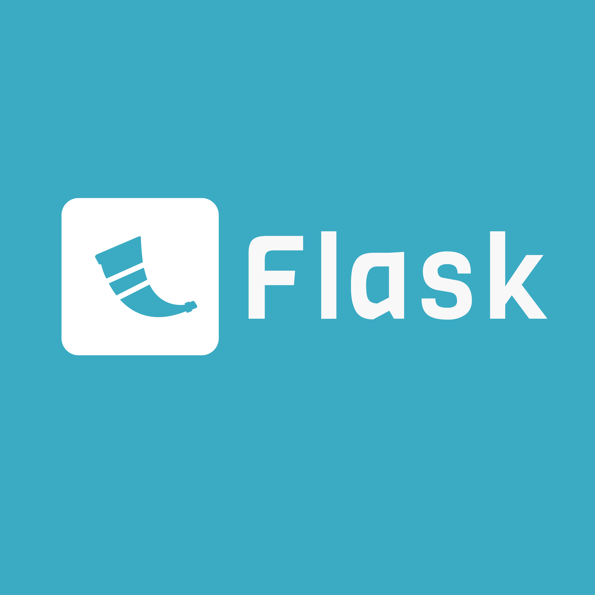

# Flask - Rest API

## Github Repository

```shell
https://github.com/bagushendrawan/Flask-API
```

## Railway deployment

```shell
https://flask-api-production-6584.up.railway.app/
```

## Swagger API Documentation

```shell
https://flask-api-production-6584.up.railway.app/swagger
```


## Installing / Getting started

A quick introduction of the minimal setup you need to get a hello world up &
running.

1. Install Python : https://www.python.org/downloads/
2. Ensure you have pip installed (it should comes with python packages)
3. Create python virtual environment

```shell
pip install virtualenv
python<version> -m venv <virtual-environment-name>
```

4. Run virtual environment
   
```shell
//Mac
source env/bin/activate

//Windows
env/Scripts/activate.bat //In CMD
env/Scripts/Activate.ps1 //In Powershel
```

5. Install required dependencies
   
```shell
pip install -r requirements.txt
```

6. Run flask app
   
```shell
flask --app main run
```

## API Routes
1. GET (/)
2. GET (/swagger)
3. POST (/register)
4. POST (/login)
5. *Protected-Bearer GET (/protected)
6. *Protected-Bearer GET (/users)


# Design Summary

## Reason for the design

## Libraries Used

## Challenges
Here you should say what actually happens when you execute the code above.
